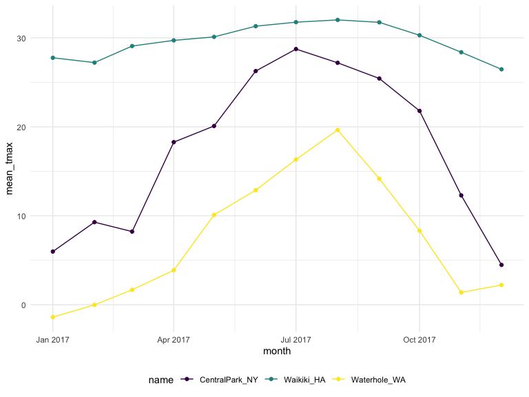
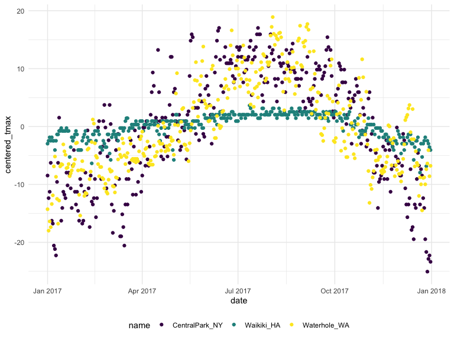

eda
================

## create the weather data

``` r
weather_df = 
  rnoaa::meteo_pull_monitors(c("USW00094728", "USC00519397", "USS0023B17S"),
                      var = c("PRCP", "TMIN", "TMAX"), 
                      date_min = "2017-01-01",
                      date_max = "2017-12-31") %>%
  mutate(
    name = recode(id, USW00094728 = "CentralPark_NY", 
                      USC00519397 = "Waikiki_HA",
                      USS0023B17S = "Waterhole_WA"),
    tmin = tmin / 10,
    tmax = tmax / 10,
    month = lubridate::floor_date(date, unit = "month")) %>%
  select(name, id, date, month, everything())
```

    ## Registered S3 method overwritten by 'crul':
    ##   method                 from
    ##   as.character.form_file httr

    ## Registered S3 method overwritten by 'hoardr':
    ##   method           from
    ##   print.cache_info httr

    ## file path:          /Users/xingchen/Library/Caches/rnoaa/ghcnd/USW00094728.dly

    ## file last updated:  2019-09-30 21:24:54

    ## file min/max dates: 1869-01-01 / 2019-09-30

    ## file path:          /Users/xingchen/Library/Caches/rnoaa/ghcnd/USC00519397.dly

    ## file last updated:  2019-09-30 21:25:04

    ## file min/max dates: 1965-01-01 / 2019-09-30

    ## file path:          /Users/xingchen/Library/Caches/rnoaa/ghcnd/USS0023B17S.dly

    ## file last updated:  2019-09-30 21:25:07

    ## file min/max dates: 1999-09-01 / 2019-09-30

## `group_by` and counting

``` r
weather_df %>% 
  group_by(name, month)
```

    ## # A tibble: 1,095 x 7
    ## # Groups:   name, month [36]
    ##    name           id          date       month       prcp  tmax  tmin
    ##    <chr>          <chr>       <date>     <date>     <dbl> <dbl> <dbl>
    ##  1 CentralPark_NY USW00094728 2017-01-01 2017-01-01     0   8.9   4.4
    ##  2 CentralPark_NY USW00094728 2017-01-02 2017-01-01    53   5     2.8
    ##  3 CentralPark_NY USW00094728 2017-01-03 2017-01-01   147   6.1   3.9
    ##  4 CentralPark_NY USW00094728 2017-01-04 2017-01-01     0  11.1   1.1
    ##  5 CentralPark_NY USW00094728 2017-01-05 2017-01-01     0   1.1  -2.7
    ##  6 CentralPark_NY USW00094728 2017-01-06 2017-01-01    13   0.6  -3.8
    ##  7 CentralPark_NY USW00094728 2017-01-07 2017-01-01    81  -3.2  -6.6
    ##  8 CentralPark_NY USW00094728 2017-01-08 2017-01-01     0  -3.8  -8.8
    ##  9 CentralPark_NY USW00094728 2017-01-09 2017-01-01     0  -4.9  -9.9
    ## 10 CentralPark_NY USW00094728 2017-01-10 2017-01-01     0   7.8  -6  
    ## # … with 1,085 more rows

`group_by` is similar to other function. When we `group_by` a dataset,
we haven’t formally change the original dataset yet. We have to say the
change manually if you want.

``` r
weather_df %>% 
  group_by(name) %>% 
  summarize(n_obs = n())
```

    ## # A tibble: 3 x 2
    ##   name           n_obs
    ##   <chr>          <int>
    ## 1 CentralPark_NY   365
    ## 2 Waikiki_HA       365
    ## 3 Waterhole_WA     365

``` r
weather_df %>% 
  group_by(month) %>% 
  summarize(
    n_obs = n(),
    n_unique = n_distinct(date))
```

    ## # A tibble: 12 x 3
    ##    month      n_obs n_unique
    ##    <date>     <int>    <int>
    ##  1 2017-01-01    93       31
    ##  2 2017-02-01    84       28
    ##  3 2017-03-01    93       31
    ##  4 2017-04-01    90       30
    ##  5 2017-05-01    93       31
    ##  6 2017-06-01    90       30
    ##  7 2017-07-01    93       31
    ##  8 2017-08-01    93       31
    ##  9 2017-09-01    90       30
    ## 10 2017-10-01    93       31
    ## 11 2017-11-01    90       30
    ## 12 2017-12-01    93       31

`count()` has the same function of `grou_by`+`summarize`

``` r
weather_df %>% 
  count(name, month)
```

    ## # A tibble: 36 x 3
    ##    name           month          n
    ##    <chr>          <date>     <int>
    ##  1 CentralPark_NY 2017-01-01    31
    ##  2 CentralPark_NY 2017-02-01    28
    ##  3 CentralPark_NY 2017-03-01    31
    ##  4 CentralPark_NY 2017-04-01    30
    ##  5 CentralPark_NY 2017-05-01    31
    ##  6 CentralPark_NY 2017-06-01    30
    ##  7 CentralPark_NY 2017-07-01    31
    ##  8 CentralPark_NY 2017-08-01    31
    ##  9 CentralPark_NY 2017-09-01    30
    ## 10 CentralPark_NY 2017-10-01    31
    ## # … with 26 more rows

The third way to get the same result. But don’t use this. Because the
result created is not a dataframe.

``` r
weather_df %>% 
  pull(name) %>% 
  table()
```

    ## .
    ## CentralPark_NY     Waikiki_HA   Waterhole_WA 
    ##            365            365            365

let’s make a nice table

``` r
weather_df %>% 
  count(name) %>% 
  knitr::kable()
```

| name            |   n |
| :-------------- | --: |
| CentralPark\_NY | 365 |
| Waikiki\_HA     | 365 |
| Waterhole\_WA   | 365 |

## 2x2 tables

a digression..

complex way

``` r
weather_df %>% 
  filter(name != "Waikiki_HA") %>% 
  mutate(
    cold = case_when(
      tmax <  5 ~ "cold",
      tmax >= 5 ~ "not cold",
      TRUE      ~ ""
    )
  ) %>% 
  group_by(name, cold) %>% 
  count() %>% 
  pivot_wider(
    names_from = cold,
    values_from = n
  )
```

    ## # A tibble: 2 x 3
    ## # Groups:   name, cold [2]
    ##   name            cold `not cold`
    ##   <chr>          <int>      <int>
    ## 1 CentralPark_NY    44        321
    ## 2 Waterhole_WA     172        193

easier way by using janitor…

``` r
weather_df %>% 
  filter(name != "Waikiki_HA") %>% 
  mutate(
    cold = case_when(
      tmax <  5 ~ "cold",
      tmax >= 5 ~ "not cold",
      TRUE      ~ ""
    )
  ) %>% 
  janitor::tabyl(name, cold)
```

    ##            name cold not cold
    ##  CentralPark_NY   44      321
    ##    Waterhole_WA  172      193

## general summaries

``` r
weather_df %>%
  group_by(name, month) %>%
  summarize(
    n = n(),
    mean_tmax = mean(tmax, na.rm = TRUE),
    sd_tmax = sd(tmax, na.rm = TRUE),
    median_prcp = median(prcp, na.rm = TRUE)
  ) %>% 
  ggplot(aes(x = month, y = mean_tmax, color = name)) + 
    geom_point() + geom_line()
```

<!-- -->

we have NAs in our data, and this gonna influence the calculations of
mean, median, and so on. Thus, `na.rm = TRUE` can help us solve this
problem.

``` r
weather_df %>%
  group_by(name, month) %>%
  summarize(
    n = n(),
    mean_tmax = mean(tmax, na.rm = TRUE)
  ) %>% 
  pivot_wider(
    names_from = name,
    values_from = mean_tmax
  ) %>% 
  knitr::kable(digits = 1)
```

| month      |  n | CentralPark\_NY | Waikiki\_HA | Waterhole\_WA |
| :--------- | -: | --------------: | ----------: | ------------: |
| 2017-01-01 | 31 |             6.0 |        27.8 |         \-1.4 |
| 2017-02-01 | 28 |             9.3 |        27.2 |           0.0 |
| 2017-03-01 | 31 |             8.2 |        29.1 |           1.7 |
| 2017-04-01 | 30 |            18.3 |        29.7 |           3.9 |
| 2017-05-01 | 31 |            20.1 |        30.1 |          10.1 |
| 2017-06-01 | 30 |            26.3 |        31.3 |          12.9 |
| 2017-07-01 | 31 |            28.7 |        31.8 |          16.3 |
| 2017-08-01 | 31 |            27.2 |        32.0 |          19.6 |
| 2017-09-01 | 30 |            25.4 |        31.7 |          14.2 |
| 2017-10-01 | 31 |            21.8 |        30.3 |           8.3 |
| 2017-11-01 | 30 |            12.3 |        28.4 |           1.4 |
| 2017-12-01 | 31 |             4.5 |        26.5 |           2.2 |

pivot\_longer is good for analysis, BUT not good for showing the results
to sombody else.

## grouped mutates

``` r
weather_df %>% 
  group_by(name) %>% 
  ungroup()
```

    ## # A tibble: 1,095 x 7
    ##    name           id          date       month       prcp  tmax  tmin
    ##    <chr>          <chr>       <date>     <date>     <dbl> <dbl> <dbl>
    ##  1 CentralPark_NY USW00094728 2017-01-01 2017-01-01     0   8.9   4.4
    ##  2 CentralPark_NY USW00094728 2017-01-02 2017-01-01    53   5     2.8
    ##  3 CentralPark_NY USW00094728 2017-01-03 2017-01-01   147   6.1   3.9
    ##  4 CentralPark_NY USW00094728 2017-01-04 2017-01-01     0  11.1   1.1
    ##  5 CentralPark_NY USW00094728 2017-01-05 2017-01-01     0   1.1  -2.7
    ##  6 CentralPark_NY USW00094728 2017-01-06 2017-01-01    13   0.6  -3.8
    ##  7 CentralPark_NY USW00094728 2017-01-07 2017-01-01    81  -3.2  -6.6
    ##  8 CentralPark_NY USW00094728 2017-01-08 2017-01-01     0  -3.8  -8.8
    ##  9 CentralPark_NY USW00094728 2017-01-09 2017-01-01     0  -4.9  -9.9
    ## 10 CentralPark_NY USW00094728 2017-01-10 2017-01-01     0   7.8  -6  
    ## # … with 1,085 more rows

``` r
weather_df %>% 
  group_by(name) %>% 
  mutate(
    mean_tmax = mean(tmax, na.rm = TRUE),
    centered_tmax = tmax - mean_tmax
  ) %>% 
  ggplot(aes(x = date, y = centered_tmax, color = name)) + 
    geom_point()
```

<!-- -->

anything we group here is gonna be group specific. mean\_tmax here is
not calculating the mean of tmax of the whole dataset. Instead, it
calculates the mean based on name.

## window functions in grouped mutates…

``` r
weather_df %>% 
  group_by(name, month) %>% 
  mutate(
    tmax_rank = min_rank(tmax)
  ) %>% 
  filter(tmax_rank == 1) %>% view()
```

other window functions: lags and leads

``` r
weather_df %>%
  group_by(name) %>%
  mutate(
    lagged_tmax = lag(tmax),
    one_day_tmax_change = tmax - lagged_tmax
  ) %>% 
  summarize(
    sd_daily_change = sd(one_day_tmax_change, na.rm = TRUE))
```

    ## # A tibble: 3 x 2
    ##   name           sd_daily_change
    ##   <chr>                    <dbl>
    ## 1 CentralPark_NY            4.45
    ## 2 Waikiki_HA                1.23
    ## 3 Waterhole_WA              3.13

By using the lag function, we could calculate the standard deviation of
tmax change for each day.
