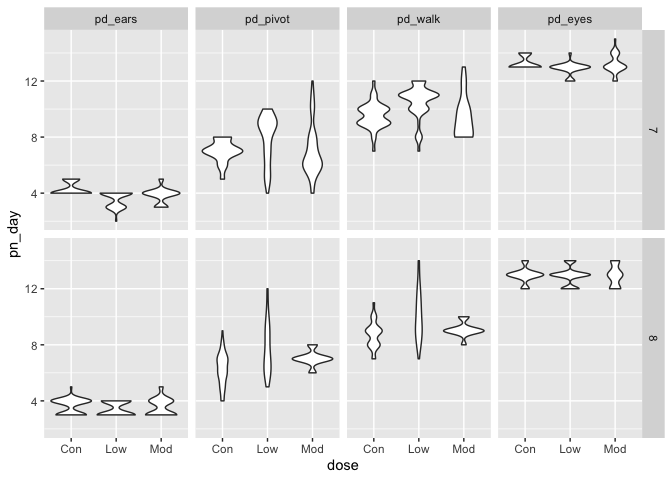

‘ggplot’ 2
================

## create the weather data

``` r
weather_df = 
  rnoaa::meteo_pull_monitors(c("USW00094728", "USC00519397", "USS0023B17S"),
                      var = c("PRCP", "TMIN", "TMAX"), 
                      date_min = "2017-01-01",
                      date_max = "2017-12-31") %>%
  mutate(
    name = recode(id, USW00094728 = "CentralPark_NY", 
                      USC00519397 = "Waikiki_HA",
                      USS0023B17S = "Waterhole_WA"),
    tmin = tmin / 10,
    tmax = tmax / 10) %>%
  select(name, id, everything())
```

    ## Registered S3 method overwritten by 'crul':
    ##   method                 from
    ##   as.character.form_file httr

    ## Registered S3 method overwritten by 'hoardr':
    ##   method           from
    ##   print.cache_info httr

    ## file path:          /Users/xingchen/Library/Caches/rnoaa/ghcnd/USW00094728.dly

    ## file last updated:  2019-09-30 21:24:54

    ## file min/max dates: 1869-01-01 / 2019-09-30

    ## file path:          /Users/xingchen/Library/Caches/rnoaa/ghcnd/USC00519397.dly

    ## file last updated:  2019-09-30 21:25:04

    ## file min/max dates: 1965-01-01 / 2019-09-30

    ## file path:          /Users/xingchen/Library/Caches/rnoaa/ghcnd/USS0023B17S.dly

    ## file last updated:  2019-09-30 21:25:07

    ## file min/max dates: 1999-09-01 / 2019-09-30

## making new plots

start with old plots

``` r
weather_df %>% 
  ggplot(aes(x = tmin, y = tmax, color = name)) +
  geom_point(alpha = .5)
```

    ## Warning: Removed 15 rows containing missing values (geom_point).

<!-- -->

add labels:

``` r
weather_df %>% 
  ggplot(aes(x = tmin, y = tmax, color = name)) +
  geom_point(alpha = .5) +
  labs(
    title = "Temperature plot",
    x = "Minimum Temp(C)",
    y = "Maximum Temp (C)",
    caption = "Data from NOAA via rnoaa package"
  )
```

    ## Warning: Removed 15 rows containing missing values (geom_point).

<!-- -->

x axis tck marks etc

``` r
weather_df %>% 
  ggplot(aes(x = tmin, y = tmax, color = name)) +
  geom_point(alpha = .5) +
  labs(
    title = "Temperature plot",
    x = "Minimum Temp(C)",
    y = "Maximum Temp (C)",
    caption = "Data from NOAA via rnoaa package"
  ) +
  scale_x_continuous(
    breaks = c(-15, -5, 20), 
    labels = c("-15C", "-5C", "20C")
  ) +
  scale_y_continuous(
    trans = "sqrt"
  )
```

    ## Warning in self$trans$transform(x): NaNs produced

    ## Warning: Transformation introduced infinite values in continuous y-axis

    ## Warning: Removed 90 rows containing missing values (geom_point).

<!-- -->

``` r
# scale_y_sqrt() has the same function
```

A `sqrt` transformation is fine here. But some of the negative values of
y are dropped from plotting because the you cannot square root a
negative value.

## colors

``` r
weather_df %>% 
  ggplot(aes(x = tmin, y = tmax, color = name)) +
  geom_point(alpha = .5) +
  labs(
    title = "Temperature plot",
    x = "Minimum Temp(C)",
    y = "Maximum Temp (C)",
    caption = "Data from NOAA via rnoaa package"
  ) + 
  scale_color_hue(
    name = "Weather Station", 
    h = c(100, 300)
  )
```

    ## Warning: Removed 15 rows containing missing values (geom_point).

<!-- -->

use viridis packages

``` r
ggp_base = 
  weather_df %>% 
  ggplot(aes(x = tmin, y = tmax, color = name)) +
  geom_point(alpha = .5) +
  labs(
    title = "Temperature plot",
    x = "Minimum Temp(C)",
    y = "Maximum Temp (C)",
    caption = "Data from NOAA via rnoaa package"
  ) + 
  viridis::scale_color_viridis(
    name = "Location", 
    discrete = TRUE
  )

ggp_base
```

    ## Warning: Removed 15 rows containing missing values (geom_point).

<!-- -->

## themes

``` r
ggp_base + 
  theme(legend.position = "bottom") +
  theme_bw()
```

    ## Warning: Removed 15 rows containing missing values (geom_point).

<!-- -->

at here, the order of command matter. we do legend first, then do
`theme_minimal`, it gonna remove everything.

`theme_bw()` can change change the color of the backgroud. grey
background and white line to white background and black lines.
`theme_minimal()` remove the line frame of the plots `theme_classic`
gives a classical plot

## setting option

## data argument in geom\*

``` r
central_park = 
  weather_df %>% 
  filter(name == "CentralPark_NY")

waikiki = 
  weather_df %>% 
  filter(name == "Waikiki_HA")

ggplot(data = waikiki, aes(x = date, y = tmax, color = name)) + 
  geom_point(aes(size = prcp)) +
  geom_line(data = central_park)
```

    ## Warning: Removed 3 rows containing missing values (geom_point).

<!-- -->

the point is we could use totally different dataset in geom\*, just like
the example whoen above. And two graphs would be stacked together.

## brief aside about colors

``` r
waikiki %>% 
  ggplot(aes(x = date, y = tmax)) +
  geom_point(color = "red")
```

    ## Warning: Removed 3 rows containing missing values (geom_point).

<!-- -->

put the color comman in the geom\* can specify the color of the point.

## Multi-panel plots

``` r
ggp_scatter = 
  weather_df %>% 
  ggplot(aes(x = tmin, y = tmax)) +
  geom_point()

ggp_density = 
  weather_df %>% 
  ggplot(aes(x = tmin)) + 
  geom_density()

ggp_box = 
  weather_df %>% 
  ggplot(aes(x = name, y = tmax)) + 
  geom_boxplot()

ggp_scatter + ggp_density
```

    ## Warning: Removed 15 rows containing missing values (geom_point).

    ## Warning: Removed 15 rows containing non-finite values (stat_density).

<!-- -->

``` r
ggp_scatter + (ggp_density / ggp_box)
```

    ## Warning: Removed 15 rows containing missing values (geom_point).
    
    ## Warning: Removed 15 rows containing non-finite values (stat_density).

    ## Warning: Removed 3 rows containing non-finite values (stat_boxplot).

<!-- -->

## data manipulation

``` r
weather_df %>% 
  mutate(
    name = factor(name),
    name = fct_relevel(name, "Waikiki_HA", "CentralPark_NY")
  ) %>% 
  ggplot(aes(x = name, y = tmax, color = name)) +
  geom_boxplot()
```

    ## Warning: Removed 3 rows containing non-finite values (stat_boxplot).

<!-- -->

use reorder instead of relevel

``` r
weather_df %>% 
  mutate(
    name = factor(name),
    name = fct_reorder(name, tmax)
  ) %>% 
  ggplot(aes(x = name, y = tmax, color = name)) +
  geom_boxplot()
```

    ## Warning: Removed 3 rows containing non-finite values (stat_boxplot).

<!-- -->

in the `fct_reorder`, we could specify how we arrange the levels of a
factor variable according to another variable.

## restructure then plot

Because we have an untidy dataset, let’s tidy it first

``` r
weather_df %>% 
  pivot_longer(
    tmax:tmin,
    names_to = "observation",
    values_to = "temperature"
  ) %>% 
  
  ggplot(aes(x = temperature, fill = observation)) + 
  geom_density(alpha = .5) +
  facet_grid(~name) +
  theme(legend.position = "bottom")
```

    ## Warning: Removed 18 rows containing non-finite values (stat_density).

<!-- -->

litters and pups

``` r
 pup_data = 
  read_csv("./data/FAS_pups.csv", col_types = "ciiiii") %>%
  janitor::clean_names() %>%
  mutate(sex = recode(sex, `1` = "male", `2` = "female")) 

litter_data = 
  read_csv("./data/FAS_litters.csv", col_types = "ccddiiii") %>%
  janitor::clean_names() %>%
  select(-pups_survive) %>%
  separate(group, into = c("dose", "day_of_tx"), sep = 3) %>%
  mutate(wt_gain = gd18_weight - gd0_weight,
         day_of_tx = as.numeric(day_of_tx))

fas_data = left_join(pup_data, litter_data, by = "litter_number")
```

**we often talk about what is relationship between x and y controlling
for a, b, c,…**

control for 1 variable: day\_ofa-tx

``` r
fas_data %>% 
  drop_na() %>% 
  ggplot(aes(x = dose, y = pd_ears)) +
  geom_violin() +
  facet_grid(day_of_tx ~ .)
```

<!-- -->

control for multiple variables…

``` r
fas_data %>% 
  pivot_longer(
    pd_ears:pd_walk,
    names_to = "outcome",
    values_to = "pn_day"
  ) %>% 
  drop_na(pn_day, dose, day_of_tx) %>% 
  mutate(
    outcome = factor(outcome),
    outcome = fct_reorder(outcome, pn_day)
  ) %>% 
  ggplot(aes(x = dose, y = pn_day)) +
  geom_violin() +
  facet_grid(day_of_tx ~ outcome)
```

<!-- -->

one thing that is important here is we have to have `drop_na()` before
`fct_reorder`. That is because we are calculating the mean of pn\_day in
`fct_reorder(outcome, pn_day)` and the existing missing values make it
not functioning.
